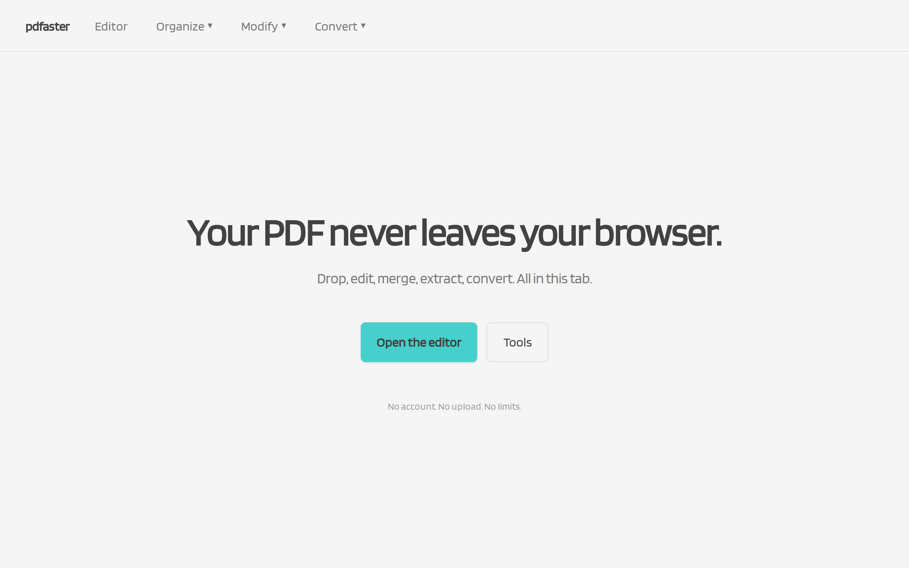

<p align="center">
  
</p>

<h1 align="center">pdfaster</h1>

<p align="center">
  <strong>Your PDF never leaves your browser.</strong><br>
  Edit, annotate, merge, extract, convert — all in this tab.<br>
  No account, no upload, no limits.
</p>

<p align="center">
  <a href="https://pdfaster.vercel.app"><strong>🌐 Live demo</strong></a>
</p>

---

A pure client-side PDF editor + tool suite, built as a static SPA. Everything happens in the browser — files never leave the device.

The privacy thesis, the no-cloud stance, and the tool-suite approach come from **[MixToolz](https://github.com/LXW1205/MixToolz-TT1L-G5)**, a web app I co-built with a group for a class assignment in 2024. pdfaster is its spiritual successor: same "process everything in your browser" stance, deeper feature set, production-grade.

## 🚀 Run

```bash
npm install
npm run dev              # vite dev server
npm run build            # production build
npm run test:e2e         # playwright e2e (31 tests, all client-side)
npm run demo:coords      # pdf-points ↔ css-px round-trip self-check
```

## 📦 What's in the box

- **Editor** — 7 annotation tools (highlight, underline, strikethrough, rectangle, ellipse, free-draw, signature) with undo/redo, zoom, page nav, thumbnails, drag-to-reorder, find-in-page, color picker, annotation list panel, AcroForm fill, and print. All exports are vector-first (text stays searchable, forms stay fillable).
- **12 tool pages** — merge, extract, delete-pages, reorder, rotate, crop, compress, watermark, page-numbers, JPG→PDF, PDF→JPG, plus the editor itself.
- **PWA** — installable, works offline.
- **Session restore + recent files** — IndexedDB saves your work-in-progress; the landing page shows the 5 most recent sessions.
- **Strict CSP** — no remote calls, no analytics, no Google Fonts CDN. Self-hosted Blinker, self-hosted pdf.js worker.

## 🛠 Stack

React 19 · Vite · TypeScript · [pdf.js](https://mozilla.github.io/pdf.js/) · [pdf-lib](https://pdf-lib.js.org/) · [zustand](https://github.com/pmndrs/zustand) · [zundo](https://github.com/charkour/zundo) · Tailwind v4 · [vite-plugin-pwa](https://vite-pwa-org.netlify.app/) · Playwright.

## 📐 Architecture

See [docs/superpowers/specs/2026-06-19-pdfaster-design.md](docs/superpowers/specs/2026-06-19-pdfaster-design.md) for the design doc (architecture, export pipeline, storage strategy, threat model, honest ceilings).

## 🏗 Inspiration

- **[MixToolz](https://github.com/LXW1205/MixToolz-TT1L-G5)** — the original group project. The privacy thesis and the "process everything in your browser" stance come from there.
- **[PDFShelter](https://pdfshelter.com/)** — the public service that proved the "no cloud, no limits" model works at scale.
- **[smallpdf.com](https://smallpdf.com/)** — used as a feature-list reference. Their Word/Excel/PPT converters, OCR, and AI tools all need servers, so they're out of scope here.
